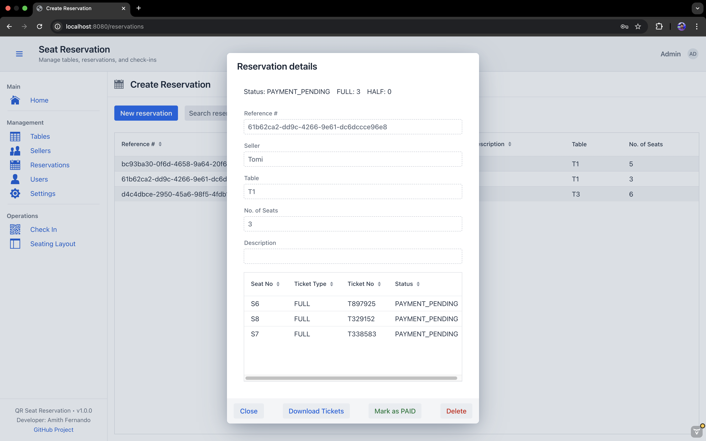

# QR Seat Reservation

A Vaadin Flow + Spring Boot app for managing event seating: tables, reservations, ticket generation, and QR code check-ins. It includes role-based access, an admin-only User Management view, and a clean, user-friendly UI.

## Table of Contents
- Features
- Tech Stack
- Screenshots
- Quick Start
- Configuration
- Build and Run
- Default Users
- Usage Overview
- Security
- Version & About
- License
- Contributing
- Troubleshooting & FAQ

## Features

- Roles and access control
  - ADMIN: full access (management, settings, users)
  - ENTRANCE: check-in and basic dashboard
- Reservations
  - Create, view, and manage reservations
  - Generate ticket numbers
  - FULL/HALF ticket support
- Seating
  - Configure tables and seats
  - Visual seating layout
- Check-in
  - QR scanner-based check-in
  - Manual ticket lookup
  - Recent check-ins list
  - Live stats (total check-ins, available, unavailable, reserved seats)
- Security
  - Spring Security + Vaadin
  - Login view at /login
  - Route-level role annotations
- UI
  - Drawer navigation
  - Header with avatar, username, and friendly logout
  - 404 “Page Not Found” and 403 “Access Denied” error views
- Admin tools
  - User Management (create, edit, enable/disable, set role, reset password)
  - Settings (event metadata, ticket layout, QR/text position, preview)
- Footer
  - Version info (with optional git data) and GitHub link

## Tech Stack

- Java 22, Spring Boot, Spring Security
- Spring Data JPA (Jakarta), Hibernate
- Vaadin Flow 24
- Maven build, npm-managed frontend
- ZXing (QR reading via Vaadin component)
- MySQL (Docker recommended locally)

## Screenshots


Login Page


Home Page


Manage Table


Manage Reservation


Reservation Details


Seating Layout


Check-in Page

## Quick Start

1) Start MySQL (Docker):
```console
foo@bar:~$ docker run --name qr-seat-reservation-db -e MYSQL_ROOT_PASSWORD=root -e MYSQL_DATABASE=qrseat -p 3306:3306 -d mysql:8
```
2) Configure datasource (application.properties):

```properties
 spring.datasource.url=jdbc:mysql://localhost:3306/qrseat?useSSL=false&allowPublicKeyRetrieval=true&serverTimezone=UTC
 spring.datasource.username=root
 spring.datasource.password=root
 spring.jpa.hibernate.ddl-auto=update
``` 

3) Run the app:


Open:
- App: http://localhost:8080/
- Login: http://localhost:8080/login

## Configuration

Common properties (application.properties):
- DB: spring.datasource.url, spring.datasource.username, spring.datasource.password
- JPA Schema: spring.jpa.hibernate.ddl-auto (use update for dev; validate for prod)

Optional version info (git.properties) to enrich footer:
- Add a git properties plugin to include commit/branch/time for builds (optional).

## Build and Run

- Development:
```console
foo@bar:~$ ./mvnw spring-boot:run
```
- Production:
```console
foo@bar:~$ ./mvnw clean package java -jar target/qr-seat-reservation-*.jar
```


Maven will handle frontend tasks (no manual npm build needed).

## Default Users

Seeded at startup:
- admin / admin123 — ADMIN
- entrance / entrance123 — ENTRANCE

You can change them later in the app.

## Usage Overview

- Home (/) — Dashboard with quick stats and actions
- Reservations — Create/manage reservations; generate tickets
- Check In — Scan tickets with camera or search manually
- Seating Layout — Visualize seats
- Settings — Event metadata, ticket layout, QR/text positions, preview
- Users — Admin-only user management

## Security

- Login via Vaadin Login Overlay
- Roles enforced with @RolesAllowed on routes
- Separate 404 and 403 error views for clarity

## Version & About

The drawer footer shows:
- Version (Implementation-Version)
- Developer info and GitHub project link

## License

QR Seat Reservation

This project includes open source components licensed under the Apache License, Version 2.0.

Vaadin is a registered trademark of Vaadin Ltd. This project is not affiliated with Vaadin Ltd. Vaadin components used by this project are available under the Apache License 2.0 (unless otherwise noted by their respective packages).

Copyright (c) 2025 Amith Fernando

Note: Vaadin Pro components (if used) require a separate commercial license.

## Contributing

- Fork the repo and create a feature branch
- Keep commits clean; add tests when possible
- Open a PR describing the change and motivation

## Troubleshooting & FAQ

- “Can’t configure requestMatchers after anyRequest”
    - Define only specific matchers in your security config and let Vaadin’s VaadinWebSecurity finalize the chain. Avoid putting anyRequest() before Vaadin’s configuration.
- Login redirect loops
    - Ensure /login is permitAll and protected routes use @RolesAllowed.
- MySQL connection issues
    - Check Docker is running, credentials match, and serverTimezone is set in the JDBC URL.
- QR camera access denied
    - Use HTTPS or allow camera access in the browser. Follow browser prompts to grant camera permissions.

Happy building!

